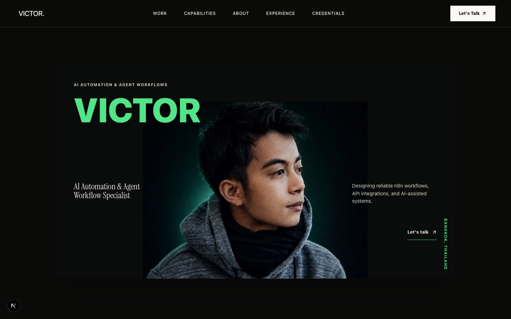

# Victor - AI Automation & Agent Workflow Portfolio

A recruiter-focused portfolio for **Victor**, an AI Automation & Agent Workflow Specialist based in Bangkok. The site presents verified n8n automation work, AI-assisted software projects, professional experience, and evidence-backed credentials without overstating production status or results.



## Portfolio Focus

- n8n workflow architecture, implementation, testing, and troubleshooting
- APIs, webhooks, LLMs, RAG, and human-in-the-loop integrations
- AI voice, content, lead, finance, job-search, and news workflows
- AI-assisted software building through specifications, testing, and release review
- Clear separation between established capabilities and current learning areas

## Selected Work

### n8n Automation

| Project | Verified role | Evidence |
| --- | --- | --- |
| AI Voice Receptionist | AI Voice Automation Builder | [Source](https://github.com/ahk1542001-wq/n8n-automation-portfolio/tree/main/AI%20Voice%20Receptionist%20for%20Dental%20Clinic%20%28Vapi%20%2B%20n8n%29) · [Demo](https://youtu.be/LKn7nkXoSGE) |
| AI Content Research & Approval Workflow | Workflow Architect | [Source](https://github.com/ahk1542001-wq/n8n-automation-portfolio/tree/main/AI%20Content%20Creation%20%28n8n%20%2B%20Telegram%20%2B%20Supabase%20%2B%20Airtable%29) · [Demo](https://youtu.be/z7fhq1tr39Y) |
| AI Job Matching & Cover Letter Workflow | AI Automation Builder | [Source](https://github.com/ahk1542001-wq/n8n-automation-portfolio/tree/main/Career%20Automation%20Agent) · [Demo](https://youtu.be/3JTJG-0S15o) |
| AI Lead Qualification & Response Workflow | Solution Designer & Workflow Architect | [Source](https://github.com/ahk1542001-wq/n8n-automation-portfolio/tree/main/AI%20Appointment%20booking) · [Demo](https://youtu.be/gz3gWqSnNVU) |
| Personal Finance Capture Workflow | AI Automation Builder | [Source](https://github.com/ahk1542001-wq/n8n-automation-portfolio/tree/main/Personal%20Finance%20Agent) · [Demo](https://youtu.be/gk14NcOgRVU) |
| Daily AI News Briefing | Workflow Architect | [Source](https://github.com/ahk1542001-wq/n8n-automation-portfolio/tree/main/Daily%20AI%20News%20Monitor) · [Demo](https://youtu.be/7EC_qIA381E) |

### AI-Assisted Software

**[Swoosh - URL Shortener & Link-in-Bio Builder](https://github.com/ahk1542001-wq/url-shortener-api)**

Role: AI-Agent-Directed Product Builder. A FastAPI and PostgreSQL application shaped through product scope, specification decisions, visual direction, test review, and release approval. [Open the live app](https://swoo-sh.onrender.com).

## Verified Credentials

- [Google AI Professional Certificate](https://www.coursera.org/account/accomplishments/professional-cert/0SL5SWTENN43) - Google / Coursera
- [Agentic prompt engineering](https://www.coursera.org/account/accomplishments/verify/SE3LIAJH33WC) - UiPath / Coursera
- [Generative AI Assistants Specialization](https://www.coursera.org/account/accomplishments/specialization/9XF3VGQU9N8Y) - Vanderbilt University / Coursera
- [AI For Everyone](https://www.coursera.org/account/accomplishments/verify/CWBKPKGKMMIK) - DeepLearning.AI / Coursera
- [Python Data Structures](https://www.coursera.org/account/accomplishments/verify/Z8R6DMF23PUK) - University of Michigan / Coursera
- Cloud 101 - Anthropic Education; completion certificate reviewed, with no public verification URL printed on the certificate

## Experience Design

- Cinematic Viridian portrait hero with restrained, reduced-motion-safe movement
- Separate n8n Automation and AI-Assisted Software tracks
- Seven statically generated project case-study routes
- Dedicated credentials route with five public verification links
- Responsive navigation and layouts for desktop, tablet, and small mobile screens
- Real approved tool and repository brand assets instead of generic placeholder marks

## Technical Stack

- Next.js App Router and React
- TypeScript
- Tailwind CSS
- Framer Motion for restrained transform and opacity motion
- Lucide icons plus approved brand assets
- Static generation for portfolio and case-study content

## Content Architecture

Approved public content is separated from presentation code:

```text
src/
├── app/                  # Routes, metadata, global styling
│   ├── credentials/      # Evidence-backed credentials page
│   └── projects/[slug]/  # Generated project case studies
├── components/           # Shared interface components
└── data/                 # Approved profile, project, and credential claims

design-system/MASTER.md   # Visual and content constraints
scripts/smoke.mjs         # Production smoke verification
```

## Local Development

Requirements: a current Node.js LTS release and npm.

```bash
git clone https://github.com/ahk1542001-wq/victor-ai-automation-portfolio.git
cd victor-ai-automation-portfolio
npm install
npm run dev
```

Open [http://localhost:3000](http://localhost:3000).

## Verification

Run the complete local quality gate:

```bash
npm run verify
```

This runs ESLint, a production Next.js build, and the smoke verification script. Visual QA is also performed at `1440`, `1024`, `390`, and `320` pixel viewport widths before release-oriented pull requests.

## Evidence & Privacy

- Public claims are maintained in `src/data/` and must be supported by project evidence or owner approval.
- Established capabilities and current learning areas are presented separately.
- Confidential client names, private workflows, credentials, raw exports, local paths, and secret-bearing files are excluded.
- Metrics, deployment claims, and outcomes are not published without supporting evidence.

## Deployment Status

The portfolio application is verified locally and is **not yet publicly deployed**. The Swoosh project linked above is a separate public application.

## Contact

- [LinkedIn](https://www.linkedin.com/in/aung-hein-kyaw)
- [GitHub](https://github.com/ahk1542001-wq)
- [Email](mailto:victor.job154@gmail.com)
